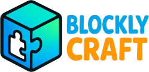

# BlocklyCraft 🎮

**Teaching Kids to Code Through Minecraft**

A visual programming learning platform where kids create real Minecraft mods by dragging and dropping blocks. What starts as pure magic becomes a deep understanding of logic, problem-solving, and programming fundamentals—without ever writing a line of code.



## 🌟 Why BlocklyCraft?

BlocklyCraft isn't just a modding tool—it's a **learning adventure** designed to help kids discover the joy of programming through something they already love: Minecraft.

### The Learning Journey

**Stage 1: Pure Magic** ✨
Kids drag colorful blocks together and see their creations come alive in Minecraft. A flame sword that shoots fire! A magic wand that summons lightning! It feels like wizardry.

**Stage 2: Understanding Patterns** 🧩
They start noticing: "When I do THIS, THAT happens." Cause and effect. Event and response. The building blocks of computational thinking.

**Stage 3: Logical Thinking** 🧠
Now they're problem-solving: "I want the sword to be MORE powerful... I need to increase THIS number and add THAT effect." They're breaking down complex ideas into simple steps.

**Stage 4: True Programming** 💻
They understand loops, conditions, variables, and logic. They're not just using a tool—they're **thinking like programmers**. And they don't even realize it because they're having too much fun!

## 🎓 What Kids Actually Learn

### Core Programming Concepts
- **Sequential Thinking** - Code runs in order, step by step
- **Conditional Logic** - IF/THEN/ELSE decisions
- **Loops & Repetition** - Repeat actions efficiently
- **Variables & Data** - Store and manipulate information
- **Events & Handlers** - Respond to player actions
- **Functions & Modularity** - Break problems into pieces
- **Debugging** - Find and fix problems logically

### 21st Century Skills
- **Computational Thinking** - Breaking complex problems into manageable parts
- **Logical Reasoning** - Understanding cause and effect relationships
- **Creative Problem-Solving** - Multiple paths to achieve goals
- **Iterative Design** - Test, learn, improve, repeat
- **Pattern Recognition** - Identifying similarities across different problems
- **Persistence** - Debugging teaches resilience and growth mindset

### Real-World Impact
Kids see their code work **instantly** in a game they love. That immediate feedback loop is incredibly powerful:
- **High Engagement** - They're motivated because it's Minecraft!
- **Safe Experimentation** - No fear of "breaking" anything
- **Visible Results** - Code creates tangible, shareable experiences
- **Social Learning** - Share mods with friends and family
- **Pride & Ownership** - "I MADE this!"

## ✨ Features

### 🎨 Kid-Friendly Design
- **Scratch-style Interface** - Familiar, colorful, drag-and-drop blocks
- **No Syntax Errors** - Blocks only fit together in valid ways
- **Visual Feedback** - See exactly what your code does
- **20+ Examples** - Learn from working projects
- **Instant Results** - Deploy to Minecraft with one click

### 🚀 Real Programming Power
- **Custom Items** - Create magical weapons, tools, and artifacts
- **Custom Mobs** - Design unique creatures with behaviors
- **Events & Actions** - Commands, right-clicks, block breaks, and more
- **Logic & Math** - Loops, conditions, variables, calculations
- **Particle Effects** - Flames, explosions, sparkles, and magic!
- **AI Model Generation** - Optional: Generate 3D models from text descriptions

### 💾 Professional Tools
- **Multi-Platform Support** - Create Fabric mods, Bukkit plugins, OR Bedrock add-ons
- **Real Minecraft Content** - Generates actual working mods/plugins/add-ons
- **SQLite Database** - Projects saved like real software
- **One-Click Deploy** - Share mods with friends instantly
- **Cross-Platform** - Desktop app or web browser
- **Version Control Ready** - Works with Git and GitHub

## 👥 Who Is This For?

### Kids & Teens (Ages 8-16)
- **Beginners** - No prior programming experience needed
- **Minecraft Players** - If they love Minecraft, they'll love this
- **Visual Learners** - See code come alive instantly
- **Creative Minds** - Build whatever they can imagine

### Educators & Parents
- **Homeschooling** - Structured programming curriculum through play
- **Computer Science Teachers** - Supplement CS fundamentals with engaging projects
- **STEM Programs** - After-school clubs, camps, workshops
- **Coding Bootcamps** - Intro to programming for young learners

### Use Cases
- **Individual Learning** - Self-paced exploration and discovery
- **Classroom Instruction** - Group projects and coding lessons
- **Parent-Child Activity** - Learn together and share creations
- **Coding Clubs** - Collaborative mod-making sessions
- **Summer Camps** - Week-long intensive programming through Minecraft

## 🎯 Quick Start

### 🚀 One-Click Startup (Recommended)

**Linux/Mac:**
```bash
npm install          # First time only
npm start            # Starts web UI + Python API
# OR for Tauri desktop app:
npm start:tauri      # Starts Tauri app (auto-starts Python API)
```

**Windows:**
```bash
npm install          # First time only
npm run start:windows  # Starts web UI + Python API
```

The startup scripts automatically:
- ✓ Start Python API servers (ports 8585/8586/8587)
- ✓ Start Vite dev server (port 1420) OR Tauri app
- ✓ Check for port conflicts
- ✓ Clean shutdown with Ctrl+C

**Choose Your Platform:**
- **Fabric** (Java Edition mods) → Port 8585
- **Bukkit/Spigot/Paper** (Java Edition plugins) → Port 8586
- **Bedrock** (Mobile/Console/Win10 add-ons) → Port 8587

### Desktop App (Alternative)

1. **Install Dependencies:**
   ```bash
   npm install
   ```

2. **Run Development Mode:**
   ```bash
   npm run tauri dev
   # Python API starts automatically!
   ```

3. **Build Desktop App:**
   ```bash
   npm run tauri build
   ```

### Web Version (Manual)

If you prefer to start services manually:

1. **Start Development Server:**
   ```bash
   npm run dev
   ```

2. **Start Python APIs** (choose one or all):
   ```bash
   # Fabric mods (Java Edition):
   python3 deploy_java_api.py

   # Bukkit plugins (Java Edition servers):
   python3 deploy_bukkit_api.py

   # Bedrock add-ons (Mobile/Console/Win10):
   python3 deploy_bedrock_api.py
   ```

3. **Open Browser:**
   - Navigate to `http://localhost:1420`
   - Select your platform in Settings

## 📦 Installation

### Prerequisites
- **Node.js** 18+ and npm
- **Rust** (for Tauri desktop app)
- **Python** 3.8+ (for API servers)
- **Java 17+** (for Fabric/Bukkit compilation)
- **Maven** (for Bukkit plugins)
- **Minecraft** - Java Edition 1.21.1 OR Bedrock Edition

### Setup

```bash
# Clone repository
git clone https://github.com/JZnebel/BlockyCraft.git
cd BlockyCraft

# Install Node dependencies
npm install

# Install Python dependencies
pip install -r requirements.txt

# Setup Tauri (if building desktop app)
cd src-tauri
cargo build
cd ..
```

### API Keys (Optional)

For AI model generation, add your OpenAI API keys in Settings:
- **Model Generation API Key** - For block display models
- **Image Generation API Key** - For item textures

## 🎮 Creating Your First Mod

### Example: Flame Sword

1. **Define Custom Item:**
   - Drag "Define Custom Item" block
   - Set name to "Flame Sword"
   - Choose base item (Gold Ingot)
   - Set rarity to EPIC

2. **Add Item Behavior:**
   - Drag "When Custom Item Used" block
   - Add "Area Effect: Damage" (radius 6, power 4)
   - Add "Area Effect: Ignite" (radius 6, power 5)
   - Add "Particles: Flame" (count 50)
   - Add "Player Effect: Strength" (duration 5 seconds)

3. **Create Get Command:**
   - Drag "When Command" block
   - Set command to `/getflamesword`
   - Add "Give Custom Item" block
   - Select "Flame Sword"

4. **Deploy:**
   - Click "Compile" to validate
   - Click "Deploy Mod" to deploy to server
   - In Minecraft: `/getflamesword`
   - Right-click to use!

## 🏗️ Architecture

### Frontend
- **React** 18 + TypeScript
- **Blockly** - Google's visual programming library
- **Zelos Renderer** - Scratch 3.0-style blocks
- **Tauri** - Desktop app framework (Rust)

### Backend
- **Python Flask APIs** (3 deployment servers)
  - Fabric API (port 8585) - Gradle-based Java mod compilation
  - Bukkit API (port 8586) - Maven-based Java plugin compilation
  - Bedrock API (port 8587) - JSON/JavaScript packaging
- **SQLite** - Local database for projects and AI models
- **Code Generators** - Platform-specific code generation
  - generators/java.js - Fabric API code
  - generators/bukkit.js - Bukkit/Spigot API code
  - generators/bedrock.js - @minecraft/server JavaScript

### Minecraft Integration
- **Java Edition** - Fabric Loader 1.21.1 OR Bukkit/Spigot/Paper
- **Bedrock Edition** - Mobile, Console, Windows 10
- **BlocklyCraft Loader** - Auto-update client mod (Fabric only)
- **HTTP Distribution** - Mod delivery system

## 📂 Project Structure

```
BlocklyCraft/
├── src/                          # React frontend
│   ├── components/               # UI components
│   │   ├── BlocklyEditor/       # Main workspace
│   │   ├── ExamplesPanel/       # Project browser
│   │   ├── AIModelsPanel/       # AI model generator
│   │   ├── Header/              # Top navigation
│   │   └── Modal/               # Modal dialogs
│   ├── blocks/                  # Blockly block definitions
│   │   ├── basic_blocks.ts      # Logic, loops, math
│   │   ├── events_actions.ts    # Minecraft events
│   │   ├── custom_items.ts      # Custom item blocks
│   │   └── ai_model_advanced.ts # AI model blocks
│   └── utils/                   # Utilities
│       ├── blockly-generator.ts # Code generation
│       ├── database.ts          # SQLite wrapper
│       └── startup-examples.ts  # Example projects
├── src-tauri/                   # Tauri desktop app
│   ├── src/                     # Rust backend
│   │   ├── commands/            # Tauri commands
│   │   │   ├── mod.rs          # Project operations
│   │   │   ├── db_commands.rs  # Database operations
│   │   │   ├── openai.rs       # AI integration
│   │   │   └── openai_codegen.rs
│   │   └── db.rs               # Database schema
│   └── tauri.conf.json         # Tauri configuration
├── blocklycraft-loader/         # Auto-update Fabric mod
│   ├── src/main/java/          # Java source
│   │   └── com/blockcraft/loader/
│   │       ├── BlocklyCraftLoader.java
│   │       └── ModDownloader.java
│   └── build.gradle            # Gradle config
├── http-installer/             # Client installer
│   ├── index.html             # Download page
│   ├── install-blocklycraft.bat    # Windows
│   ├── install-blocklycraft.command # Mac
│   └── install-blocklycraft.sh     # Linux
├── deploy_java_api.py         # Flask API server
└── public/                    # Static assets
    ├── categories/            # Category icons
    └── minecraft-textures/    # 2,000+ block textures

```

## 🔧 API Endpoints

### Fabric Deployment API (Port 8585)
- `POST /api/deploy` - Compile and deploy Fabric mod
- `GET /api/mods-manifest` - List deployed mods (for auto-updater)
- `GET /health` - Check API status

### Bukkit Deployment API (Port 8586)
- `POST /api/deploy` - Compile and deploy Bukkit plugin
- `GET /health` - Check API status

### Bedrock Deployment API (Port 8587)
- `POST /api/deploy` - Package and deploy Bedrock add-on
- `GET /health` - Check API status

### Parameters
```json
{
  "projectId": "my_project",
  "projectName": "My Mod",
  "platform": "fabric|bukkit|bedrock",
  "commands": [...],
  "events": [...],
  "customItems": [...],
  "customMobs": [...],
  "aiModels": [...]
}
```

## 🎨 Block Categories

### Events (Purple)
- When Command - `/command`
- When Right Click - Item interaction
- When Break Block - Block breaking

### Actions (Green)
- Display Message - Chat messages
- Give Item - Item rewards
- Spawn Mob - Entity spawning
- Play Sound - Sound effects
- Particles - Visual effects

### Logic (Blue)
- If/Else - Conditional logic
- Repeat - Loops
- And/Or - Boolean operations

### Player (Light Blue)
- Player Health - Modify health
- Player Effect - Status effects
- Is Sneaking - Check conditions

### Motion (Dark Blue)
- Teleport Forward - Movement
- Launch - Knockback effects

### Custom Items (Orange)
- Define Custom Item - Create items
- Custom Item Used - Item behavior
- Give Custom Item - Item distribution

### AI Models (Pink)
- Spawn AI Model - Place 3D models
- Spawn Scaled - Size variation
- Spawn Rotated - Orientation
- Spawn Circle - Pattern placement

## 🤝 Contributing

We welcome contributions from developers, educators, and parents! Ways to help:

### For Developers
- Add new block types and Minecraft features
- Improve UI/UX for young learners
- Fix bugs and optimize performance
- Enhance documentation and examples

### For Educators
- Create lesson plans and curricula
- Design learning activities and challenges
- Share classroom success stories
- Suggest age-appropriate features

### For Parents & Users
- Report bugs and usability issues
- Suggest kid-friendly improvements
- Share example projects
- Help with documentation

**How to Contribute:**
1. Fork the repository
2. Create a feature branch
3. Make your changes
4. Test thoroughly (especially with kids!)
5. Submit a pull request

## 📄 License

MIT License - See LICENSE file for details

## 🙏 Acknowledgments

### Built on the Shoulders of Giants
- **Google Blockly** - The visual programming framework that makes coding accessible
- **MIT Scratch** - Pioneering visual programming for kids since 2007
- **Fabric Mod Loader** - Minecraft modding framework
- **Tauri** - Modern desktop app framework

### Inspired By
- **Seymour Papert** - Pioneer of constructionist learning (Logo, 1967)
- **Mitchel Resnick** - Creator of Scratch (MIT Media Lab)
- **Code.org** - Making computer science accessible to all
- **Minecraft Education Edition** - Learning through gaming

### The Philosophy
BlocklyCraft follows the principles of **constructionist learning**: kids learn best when they're actively building things they care about. By combining visual programming with Minecraft—something millions of kids already love—we create an environment where learning happens naturally through play, experimentation, and creation.

## 🐛 Troubleshooting

### Desktop App Won't Start
- Check Rust is installed: `rustc --version`
- Rebuild: `cd src-tauri && cargo clean && cargo build`

### Compilation Fails
- Ensure Java 21 is installed: `java -version`
- Check Python API is running on port 8585

### Mods Don't Load in Minecraft
- Install Fabric Loader 1.21.1
- Place mods in `.minecraft/mods/`
- Check Fabric API is installed

### AI Models Not Generating
- Verify OpenAI API keys in Settings
- Check API key has sufficient credits
- Ensure Python API has internet access

## 📞 Support

- **Issues:** [GitHub Issues](https://github.com/JZnebel/BlockyCraft/issues)
- **Discussions:** [GitHub Discussions](https://github.com/JZnebel/BlockyCraft/discussions)

---

**Made with ❤️ for curious kids, passionate educators, and supportive parents.**

*Every programmer started by being amazed that they could make a computer do something. BlocklyCraft brings that magical moment to kids through a game they already love.*
